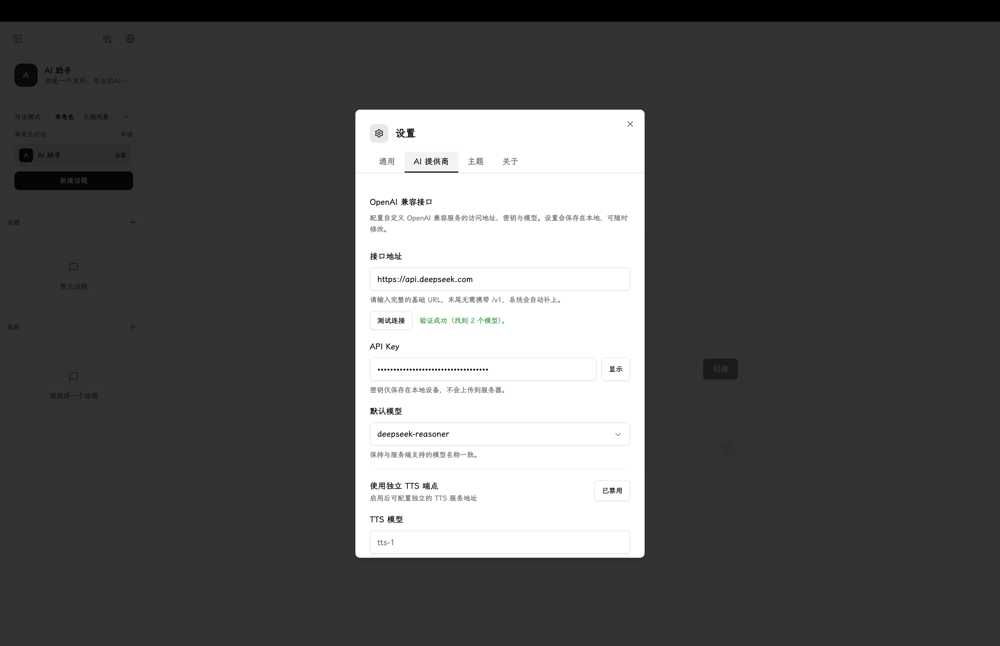

<p align="center">
  
</p>

# AhaKnow Chat

[中文](./README.zh-CN.md) | English

> A local-first AI chat workspace for prompt testing, topic-based threads, reusable roles, and personal knowledge exploration.

**Open the web app:** [chat.ahaknow.com](https://chat.ahaknow.com)

AhaKnow Chat is built for people who want more structure than a disposable chat box, but less overhead than a heavy knowledge system. It lets you organize conversations by topic, split work into threads, reuse role presets, and keep the whole workspace in your own browser.

This `vercel-web` branch is a Vercel-first, web-only deployment branch. It removes Electron build dependencies so `npm ci` and static deployment can run cleanly on Vercel.

## A Quick Tour

### Home


Start a topic, pick a mode, and keep the workspace organized from the first message.

### In Use


Work inside topic-based threads instead of one endless running chat.

### Settings



Connect any OpenAI-compatible service, such as DeepSeek, by configuring the endpoint, API key, and default model.

## What Makes It Different

- Topic-first structure instead of a single endless chat log.
- Reusable roles for repeatable prompting and scenario testing.
- Single-role chat and multi-role conversations in the same workspace.
- Browser-local storage by default for a local-first workflow.
- Static Vite deployment that can go straight to Vercel.

## Why AhaKnow?
Built out of a personal need to test prompts efficiently and organize AI conversations without losing track of context. It started as an experiment and is now my daily driver.

## Project Status

This repository is being published publicly, but the positioning should stay honest. At its current stage, AhaKnow Chat is closer to a practical chatbot and prompt playground than a fully mature research workflow system.

## What It Does Today

- Connect to any OpenAI-compatible API with your own API key.
- Organize conversations by topics, threads, and reusable roles.
- Support single-role chat and multi-role conversations.
- Persist data locally in the browser.
- Deploy as a static Vite app on Vercel.

## Configure an AI Provider

1. Open `Settings` from the app.
2. Go to the `AI Provider` tab.
3. Set the `Base URL` to your provider endpoint, for example `https://api.deepseek.com`.
4. Paste your API key into the `API Key` field.
5. Click `Test Connection` to verify the endpoint and load available models.
6. Pick a default model such as `deepseek-chat` or `deepseek-reasoner`.
7. Save the configuration, create a topic, and start chatting.

Notes:

- The web version stores configuration locally in the browser.
- For Vercel deployments, the target endpoint must allow browser requests and CORS.
- Any provider exposing an OpenAI-compatible API can be connected this way.

## Current Boundary

Good fit if you want:

- a personal AI workspace
- a prompt and role testing surface
- local-first conversation history
- a frontend codebase that is easy to fork and extend

Not a good fit yet if you need:

- team collaboration
- multi-tenant accounts
- server-side hosted storage
- a full research, evidence, and publishing pipeline

## Stack

- React 19
- TypeScript
- Vite
- Tailwind CSS
- Zustand
- IndexedDB

## Quick Start

### 1. Install

```bash
npm install
```

### 2. Start Web Dev

```bash
npm run dev
```

## Build Commands

```bash
# Web build
npm run build

# Preview web production build
npm run preview
```

## Environment

Example files:

- `.env.example`
- `.env.production.example`

Common variables:

- `VITE_PORT`
- `VITE_LOG_LEVEL`
- `VITE_ENABLE_CONSOLE_LOG`
- `VITE_ENABLE_FILE_LOG`
- `VITE_APP_VERSION`
- `VITE_DEBUG`

## Deploy to Vercel

This branch is configured for Vercel as a static Vite web app and does not install Electron desktop dependencies during deployment.

Vercel configuration:

- Install command: `npm ci --ignore-scripts`
- Build command: `npm run build:web`
- Output directory: `dist`

Steps:

1. Import the repository into Vercel.
2. Keep the detected framework as `Vite`.
3. Deploy with the default project settings from `vercel.json`.

## Important Note

The hosted web app is currently client-side only. It sends requests directly from the browser to the configured AI endpoint, which means:

- users need to bring their own API key
- data is stored in the browser, not on Vercel
- the target API must allow browser requests and CORS

## Project Structure

```text
.
├─ src/            React renderer, stores, services, and platform adapters
├─ scripts/        Web build and local tooling helpers
├─ assets/         Static assets and icons
├─ docs/           Changelog and project notes
└─ vercel.json     Vercel web deployment config
```

## Roadmap

Short term:

- stabilize the open-source web experience
- improve onboarding and docs
- reduce desktop-only assumptions in the UI

Long term:

- evolve from chat-first interaction toward stronger knowledge workflows
- add export, evidence, and publishing primitives
- evaluate a safer server-side proxy or hosted architecture

## Contributing

Issues and pull requests are welcome, especially for:

- web deployment reliability
- local-first UX
- prompt and role workflows
- codebase clarity

## License

This project is licensed under `PolyForm Noncommercial 1.0.0`. You can read, study, modify, and redistribute the code for noncommercial purposes, but you may not use AhaKnow Chat or its derivatives for commercial purposes without separate permission from the maintainer.

Strictly speaking, this is not an OSI-approved open source license. It is more accurately described as `source-available`, because it includes a noncommercial restriction.

See [LICENSE](./LICENSE) for the binding legal text and [LICENSE.zh-CN.md](./LICENSE.zh-CN.md) for a non-binding Chinese summary.
